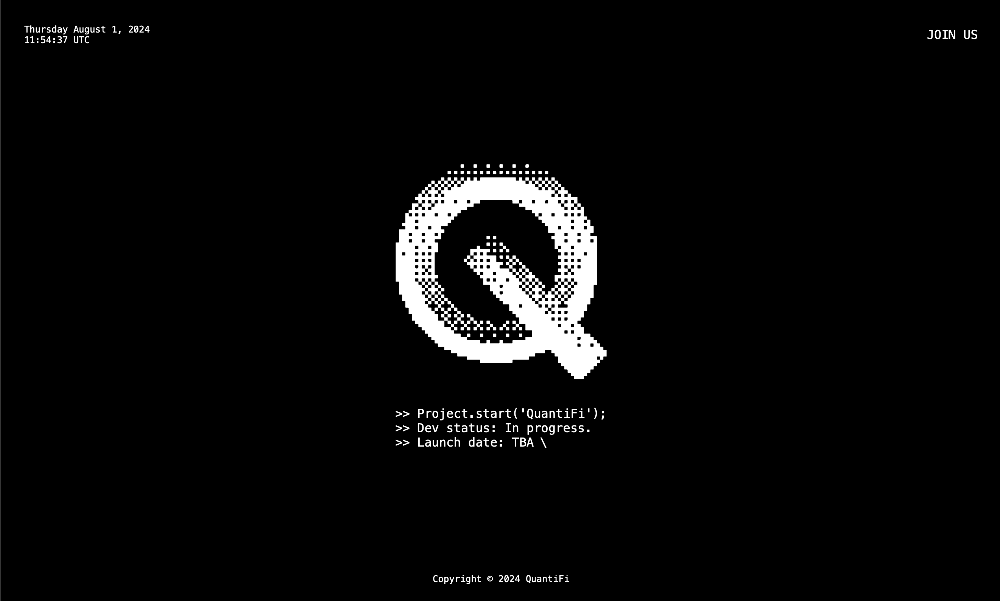

# QuantiFi Landing Page

## Table of contents

- [QuantiFi Landing Page](#quantifi-landing-page)
  - [Table of contents](#table-of-contents)
  - [Getting started](#getting-started)
    - [Download repository](#download-repository)
    - [Install dependencies](#install-dependencies)
    - [Run in development mode](#run-in-development-mode)
    - [Preview in production mode](#preview-in-production-mode)
    - [Build for production](#build-for-production)
  - [Authors](#authors)
  - [License](#license)

## Getting started

### Download repository

To download this project, please do: `git clone https://github.com/tun43p/quantifi-landing-page.git`.

### Install dependencies

To install this project, please do: `npm install`.

### Run in development mode

To run this project in development mode, please do: `npm run dev` or `npm run start`.

### Preview in production mode

To preview this project in production mode, please do: `npm run preview`.

### Build for production

To build this project for production, please do: `npm run build`.

## Authors

- **tun43p** - _Initial work_ - [tun43p](https://github.com/tun43p).

## License

This project is licensed under the MIT License, see the [LICENSE](LICENSE) file for details.
